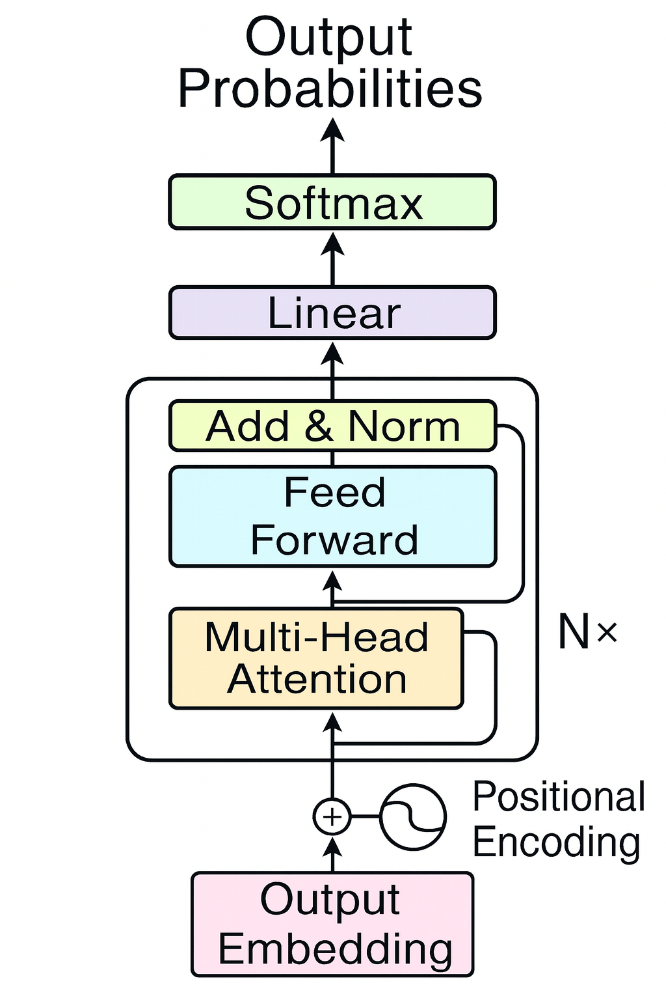

# Transformer From Scratch Based on “Attention Is All You Need”

This project is a small GPT-like decoder-only transformer built from scratch for learning purposes. It follows the ideas from Andrej Karpathy’s video **["Let’s build GPT: from scratch, in code, spelled out"](https://www.youtube.com/watch?v=kCc8FmEb1nY&t=3886s)**.

The implementation covers the core components of a transformer decoder, including masked self-attention, residual connections, layer normalization, and a feed forward network. There is no encoder and no cross attention because this is not a machine translation task. The model is designed for simple next-token prediction to generate text.  

The training data is a character-level corpus built from Jensen Huang interviews using the YouTube Transcript API. The goal is to model how characters follow each other. Given a context window, the model predicts the most likely next character. Once trained, it can generate sequences that resemble the style of `jensen_huang.txt`.

---

## Decoder Architecture

This model is based on the Transformer decoder, but does not include  the **cross-attention** block since it’s not needed for a pure decoder-only language model like GPT.  

In the original Transformer from *Attention Is All You Need*, cross-attention lets the decoder look at the encoder outputs, which is useful for tasks like machine translation.  

For GPT-style models, there’s no encoder, so we keep it simple with masked multi-head attention, feed-forward layers, and positional encodings.



## **Project Structure**

### **1. Data Processing**
- Loads and tokenizes the Jensen Huang transcript into a vocabulary of unique characters.
- Converts text into integer token IDs for model input.
- Defines helper functions for encoding and decoding between text and token IDs.

### **2. Model Components**
- **Head**  
  Implements single-head self-attention using queries, keys, and values derived from the same token embeddings. Includes causal masking so the model cannot look ahead.

- **MultiHeadAttention**  
  Runs multiple attention heads in parallel, concatenates their outputs, and projects them back to the embedding dimension.

- **FeedForward**  
  A two-layer MLP with ReLU activation. Expands the embedding dimension by a factor of 4 in the hidden layer before projecting back down.

- **Block**  
  A transformer block that chains a MultiHeadAttention layer and a FeedForward layer, each wrapped with residual connections.

- **LayerNorm1d**  
  Custom implementation of layer normalization that normalizes across the embedding dimension, with learnable scale (`gamma`) and shift (`beta`) parameters.

- **Bigram Language Model**  
  - Token embedding layer to map token IDs to embeddings.  
  - Positional embeddings to encode the order of tokens in a sequence.  
  - Stacks of `Block` layers to learn contextual relationships.  
  - Final linear layer (`lm_head`) to project embeddings to vocabulary logits.

### **3. Training Loop**
- Uses a context length (`block_size`) to create input and target sequences.
- Processes data in batches (`batch_size`) for parallel training.
- Uses cross-entropy loss to measure prediction accuracy.
- Periodically evaluates the model on training and validation sets.
- Supports running on CPU or GPU depending on `torch.cuda.is_available()`.

### **4. Text Generation**
- Starts from an initial context (e.g., a special start token or given text).
- Iteratively predicts the next token, appends it to the context, and continues until the desired length is reached.
- Includes a decoding function to convert generated token IDs back to readable text.

---

## **Example Output**
After training, the model can generate text in the style of Jensen Huang’s interviews. For example:
```bash
We have figured the other industry company. NVIDIA understands it.
```

--- 

## Usage

### 1. Clone the Repository
```bash
git clone https://github.com/yourusername/gpt-from-scratch.git
cd gpt-from-scratch
```

### 2. Install Dependencies
```bash
pip install torch numpy
```

### 3. Prepare the dataset 
Ensure jensen_huang.txt is in the project directory. This should contain your character-level training corpus generated using the YouTube Transcript API.

### 4. Train the Model
```bash
python bigram.py
```
This will train the GPT-like model on the provided dataset using the hyperparameters set in bigram.py and generate the next predicted text in output.txt.

💡 Tip: If you are using a GPU, you can increase or tune the hyperparameters (e.g., n_embed, n_layer, block_size, batch_size) to achieve a lower loss and much more coherent text generation results.

---

## **References**
- [Andrej Karpathy – Let’s build GPT from scratch](https://www.youtube.com/watch?v=kCc8FmEb1nY)
- [PyTorch Documentation](https://pytorch.org/docs/stable/index.html)

---

## Author

**Jasjot Parmar**  
Aspiring Data Scientist | Python & Machine Learning Enthusiast | Data Science Graduate Student

🔗 [GitHub](https://github.com/jasjotp) • [LinkedIn](https://www.linkedin.com/in/jasjotparmar)

---
